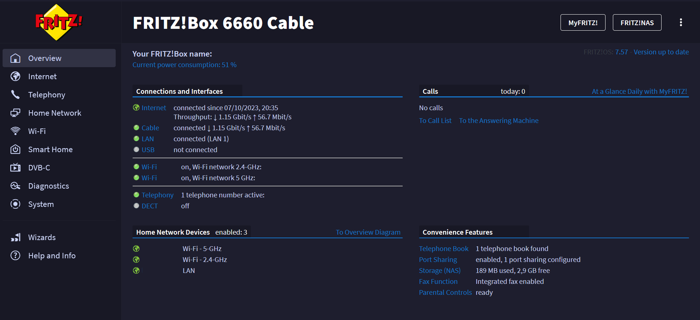

<h3 align="center">
  
	 
	Catppuccin Theme for the Fritz!Box
  
  </h3>

  
	

# Fritz!Box Catppuccin Mocha Theme

A dark pastel Catppuccin Theme for the Fritz!Box Router

## Installation
1. Install Stylus for [Firefox](https://addons.mozilla.org/en-US/firefox/addon/styl-us/) or [Chrome](https://chrome.google.com/webstore/detail/stylus/clngdbkpkpeebahjckkjfobafhncgmne)
2. Download .user.css and install it.
